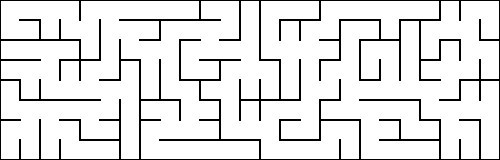

# Meiro 迷路

Maze generation code, inspired by working through [Mazes for
Programmers](https://pragprog.com/book/jbmaze/mazes-for-programmers).
Because the book leans on Object Oriented design (coded in Ruby), much of this
is a re-thinking of the approaches in a Clojure style.

Each maze generation algorithm is in its own namespace.

| [Usage](#usage)
| [Algorithms](#algorithms)
| [Solutions](#solutions)
| [Utilities](#utilities)


## Usage

Project is currently _under development_ and does not have functions exposed for
external use.


### Displaying Mazes

There are several ways to display a maze. The data structure used to store a
maze is a vector of vectors, where each cell indicates which directions you can
navigate out of the cell to.

Here is a 5x5 maze:
```clojure
[[[:east] [:south :west :east] [:west :east] [:west :south] [:south]]
 [[:east :south] [:east :north :west] [:south :west] [:north :east] [:west :north]]
 [[:north :east] [:west] [:south :north :east] [:west] [:south]]
 [[:south] [:south] [:south :north :east] [:west :east] [:west :north :south]]
 [[:east :north] [:north :west :east] [:west :north] [:east] [:north :west]]]
```

The easiest way to visualize a maze at the REPL is to generate an ASCII
version:
```clojure
user=> (require '[meiro.ascii :as ascii])
nil
user=> (print (ascii/render maze))
+---+---+---+---+---+
|               |   |
+---+   +---+   +   +
|           |       |
+   +---+   +---+---+
|       |       |   |
+---+---+   +---+   +
|   |   |           |
+   +   +   +---+   +
|           |       |
+---+---+---+---+---+
nil
```

And if you want to print or share a maze, it can be output as a PNG:
```clojure
(require '[meiro.png :as png])
(png/render (sw/create (m/init 15 20)) "sample-maze.png")
```
Which creates a PNG file like:


To print a maze with masked cells:
```clojure
(def grid (ascii/read-grid "template.txt"))
(png/render-masked (b/create grid))
```


To print a circular (polar) maze:
```clojure
(png/render-polar
  (b/create (polar/init 10) [0 0] polar/neighbors polar/link))
```


To print a sigma (hex) maze:
```clojure
(png/render-hex
  (b/create (m/init 15 20) [7 9] hex/neighbors hex/link))
```


To print a delta (triangle) maze:
```clojure
(def grid (ascii/read-grid "test/meiro/triangle.txt"))
(png/render-delta
  (b/create grid [0 12] triangle/neighbors m/link))
```


To print a maze with an inset:
```clojure
(png/render-inset (b/create (m/init 8 25)) 3)
```


To print a maze composed of edges, the image must be bored out of a background
image. Use the following:
```clojure
(require '[meiro.prim :as prim])
(def forest (prim/create 25 8))
(png/render-forest forest)
```



If you want to print an ASCII maze as if it were a series of corridors in
NetHack:
```clojure
(require '[meiro.nethack :as nethack])
(print (nethack/render-corridor maze))

####### # ####### ####### ####### #
#     # # # #   # #     # #     # #
### # # ### ### # ### ##### # ### #
  # # #       # #   #       # #   #
### # ### ### # ### ####### ### ###
#   #   # # # #   #       # #     #
# # ### # # ### # ### ##### ##### #
# # #   # #     #   # #         # #
# # # ### ### ##### # ### ##### # #
# # # #     # #   # #   # # #   # #
### ######### ### ####### # #######

```

If you want to print an ASCII maze as if it were a situated in a
NetHack room (corners could use some work):
```clojure
(print (nethack/render-room maze))
-------------------------------------
|.......|.|.......|.......|.......|.|
|.-----.|.|.-.---.|.-----.|.-----.|.|
|...|.|.|...|...|.|...|.....|.|...|.|
|--.|.|.|------.|.|--.|------.|.---.|
|...|.|...|...|.|...|.......|...|...|
|.---.|--.|.-.|.|--.|------.|.-----.|
|.|.|...|.|.|...|.|...|.....|.....|.|
|.|.|.---.|.|----.|--.|.---------.|.|
|.|.|.|...|...|.....|.|...|.....|.|.|
|.|.|.|.-----.|.---.|.|--.|.-.---.|.|
|...|.........|...|.......|.|.......|
|------------------------------------
```


## Algorithms

There are a number of different algorithms for generating mazes.


### Binary Tree

Binary Tree produces mazes with a bias toward paths which flow down and to the
right. They will always have a single corridor along both the southern and
eastern edges.

If you wish to generate and print a random binary-tree maze, you can start up a
REPL and try to following:
```clojure
(require '[meiro.core :as m])
(require '[meiro.ascii :as ascii])
(require '[meiro.binary-tree :as bt])
(png/render (bt/create (m/init 8 25)))
```

Which will produce a maze like:


### Sidewinder

Sidewinder is based upon Binary Tree, but when it navigates south, it chooses a
random cell from the current horizontal corridor and generates the link from
there. The mazes will still flow vertically, but not to the right as with Binary
Tree. All mazes with have a single horizontal corridor along the southern edge.

To generate a maze using the sidewinder algorithm:
```clojure
(require '[meiro.sidewinder :as sw])
(png/render (sw/create (m/init 8 25)))
```

Which will produce a maze like:


### Aldous-Broder

To generate a random-walk maze using Aldous-Broder:
```clojure
(require '[meiro.aldous-broder :as ab])
(png/render (ab/create (m/init 8 25)))
```

Which will produce a maze like:


### Wilson's

To generate a loop-erasing, random-walk maze using Wilson's:
```clojure
(require '[meiro.wilson :as w])
(png/render (w/create (m/init 8 25)))
```

Which will produce a maze like:


### Hunt and Kill

To generate a random-walk maze biased to first visited cell using Hunt and Kill:
```clojure
(require '[meiro.hunt-and-kill :as hk])
(png/render (hk/create (m/init 8 25)))
```

Which will produce a maze like:


### Recursive Backtracker

To generate a random-walk maze biased to last unvisited cell on the path using
the Recursive Backtracker:
```clojure
(require '[meiro.backtracker :as b])
(png/render (b/create (m/init 8 25)))
```

Which will produce a maze like:


### Kruskal's

Kruskal's algorithm is focused on generating a minimum spanning tree. I decided
to use a more graph-centric approach, so the `create` function returns a
"forest", a map which includes the nodes and edges. At this time, this requires
that it be converted to a grid-style maze in order to render it. It also uses
`x, y` coordinates, so is "backward" from the other algorithms to this point.
```clojure
(require '[meiro.kruskal :as k])
(require '[meiro.graph :as graph])
(def forest (k/create 25 8))
(def maze (graph/forest-to-maze forest))
(png/render maze)
```

Which will produce a maze like:


### Prim's

Prim's algorithm generates a minimum spanning tree by starting with a position
and adding the "cheapest" edge available. Weights are assigned randomly to
ensure a less biased maze. Like Kruskal's, the approach is graph-centric and
`create` returns a collection of edges.
```clojure
(require '[meiro.prim :as prim])
(require '[meiro.graph :as graph])
(def forest (prim/create 25 8))
(def maze (graph/forest-to-maze forest))
(png/render maze)
```

Which will produce a maze like:


### Growing Tree

The Growing Tree algorithm is an abstraction over the approach in Prim's
algorithm.
It needs to be passed a `queue` which holds the active edges of the growing tree
(forest), a `poll-fn` which removes an edge from the `queue`, and a `shift-fn`
which transfers the edges of a newly added node from the set of remaining,
unexplored edges to the `queue`.

To implement Prim's algorithm using Growing Tree:
```clojure
(require '[meiro.growing-tree :as grow])
(require '[meiro.prim :as prim])
(def forest (grow/create 25 8
                         (java.util.PriorityQueue.)
                         prim/poll
                         prim/to-active!))
(def maze (graph/forest-to-maze forest))
(png/render maze)
```

Which will produce a maze like:


But, Growing Tree can also be used to implement Recursive Backtracker.
_Note: if you do not suffle the new edges, the resulting "maze" will mostly be a
series of connected corridors._
```clojure
(require '[meiro.growing-tree :as grow])

(defn back-poll
  [q]
  [(first q) (rest q)])

(defn back-shift
  [new-edges queue remaining-edges]
  (reduce
    (fn [[q es] e]
      (let [remaining (disj es e)]
        (if (= es remaining)
          [q es]
          [(conj q e)
           remaining])))
    [queue remaining-edges]
    (shuffle new-edges)))

(def forest (grow/create 25 8 '() back-poll back-shift))
(def maze (graph/forest-to-maze forest))
(png/render maze)
```

Which will produce a maze like:


### Eller's

Eller's algorithm processes a row at a time, creating forests as it goes. It
also behaves like Sidewinder, in that it will connect to the next row from one
random position in a horizontal corridor.

To create a maze using Eller's:
```clojure
(require '[meiro.eller :as eller])
(def forest (eller/create 25 8))
(png/render (graph/forest-to-maze forest))
```

Which will produce a maze like:


## Solutions

To calculate the distance from the north-east cell to each cell using Dijkstra's
algorithm:
```clojure
(require '[meiro.dijkstra :as d])
(def maze (sw/create (m/init 8 8)))
(def dist (d/distances maze))
(print (ascii/render maze (ascii/show-distance dist)))
```

Which will produce a maze like:
```
+---+---+---+---+---+---+---+---+
| 0   1 | 4 | n | q   p | o   n |
+   +---+   +   +---+   +---+   +
| 1   2   3 | m   l | o   n | m |
+   +---+---+---+   +---+   +   +
| 2   3 | m   l | k   l | m | l |
+---+   +---+   +   +---+   +   +
| 5   4 | l   k   j   k | l | k |
+   +---+---+---+   +---+   +   +
| 6 | 9 | k   j   i | h | k   j |
+   +   +---+---+   +   +---+   +
| 7   8   9   a | h   g | j | i |
+---+---+   +---+---+   +   +   +
| g   f | a   b | g   f | i   h |
+---+   +---+   +---+   +---+   +
| f   e   d   c   d   e   f   g |
+---+---+---+---+---+---+---+---+
```

To calculate and show a solution:
```clojure
(def maze (b/create (m/init 8 25)))
(def sol (d/solution maze [0 0] [0 24]))
(print (ascii/render maze (ascii/show-solution sol)))
```

Which will produce a maze like:
```
+---+---+---+---+---+---+---+---+---+---+---+---+---+---+---+---+---+---+---+---+---+---+---+---+---+
| *     |           | *   * | *   *                 | *   *   *   *   *   * |         *   * | *   * |
+   +   +   +   +---+   +   +   +   +---+---+---+   +   +---+   +---+---+   +---+---+   +   +   +   +
| * |       |   | *   * | *   * | *   * |           | * |   |   |       | * | *   * | * | *   * |   |
+   +---+---+---+   +---+---+---+---+   +---+---+---+   +   +   +   +   +   +   +   +   +---+---+   +
| *   * | *   * | * | *   * |       | * | *   *   *   * |   |   |   |   | *   * | *   * |   |       |
+---+   +   +   +   +   +   +   +   +   +   +---+---+---+   +   +   +   +---+---+---+---+   +   +---+
| *   * | * | * | *   * | *   * |   | * | * |               |       |   |               |   |       |
+   +---+   +   +---+---+---+   +---+   +   +---+---+   +   +---+---+   +   +---+---+   +   +---+   +
| *   *   * | *     | *   *   * | *   * | * | *   * |   |           |       |   |       |       |   |
+---+---+---+   +   +   +---+---+   +   +   +   +   +---+---+   +   +---+---+   +   +---+---+   +   +
| *   *   *   * |   | *   *     | * |   | * | * | *   *   * |   |               |           |       |
+   +---+---+   +---+---+   +---+   +   +   +   +---+---+   +---+---+---+---+   +---+---+   +   +---+
| *   *   * |   | *   * | * | *   * |   | *   * | *   * | *   *   *   *   *   *   * |   |   |   |   |
+   +---+   +---+   +   +   +   +---+---+---+---+   +   +---+---+---+---+---+---+   +   +   +   +   +
|       | *   *   * | *   * | *   *   *   *   *   * | *   *   *   *   *   *   *   * |       |       |
+---+---+---+---+---+---+---+---+---+---+---+---+---+---+---+---+---+---+---+---+---+---+---+---+---+
```


## Utilities

There are a few additional utilities besides deriving solutions.


### Longest Path

Dijkstra's distances calculation can be used to find the position furthest from
a given start point. If none is provided, it will assume the upper left-hand
corner position.
```clojure
(d/farthest-pos maze)

[2 20]
```

By running this algorithm twice, the second time with the output of the first
run, you can determine the longest path in a maze. This can be useful if you are
looking to determine start and end points. This function returns a path with
all the positions.
```clojure
(d/longest-path maze)

([6 20] [6 19] [7 19] [7 20] [7 21] [6 21] [5 21] [5 20] [5 19] [5 18] [6 18]
 [7 18] [7 17] [6 17] [6 16] [7 16] [7 15] [6 15] [6 14] [7 14] [7 13] [6 13]
 [5 13] [5 14] [5 15] [4 15] [4 16] [3 16] [2 16] [1 16] [1 15] [2 15] [2 14]
 [2 13] [3 13] [3 14] [4 14] [4 13] [4 12] [4 11] [5 11] [5 12] [6 12] [7 12]
 [7 11] [6 11] [6 10] [7 10] [7 9] [6 9] [6 8] [7 8] [7 7] [7 6] [7 5] [7 4]
 [7 3] [7 2] [7 1] [7 0] [6 0] [5 0] [4 0] [3 0] [2 0] [2 1] [1 1] [1 0] [0 0]
 [0 1] [0 2] [1 2] [1 3] [1 4] [1 5] [1 6] [1 7] [0 7] [0 8] [1 8] [1 9] [2 9]
 [2 8] [2 7] [2 6] [3 6] [4 6] [4 5] [4 4] [5 4] [5 3] [4 3] [3 3] [3 2] [3 1]
 [4 1] [5 1] [6 1] [6 2] [6 3] [6 4] [6 5] [5 5] [5 6] [5 7] [4 7] [4 8] [4 9]
 [5 9] [5 10] [4 10] [3 10] [3 11] [3 12] [2 12] [1 12] [1 13] [0 13] [0 14]
 [0 15][0 16] [0 17] [0 18] [1 18] [2 18] [2 19] [3 19] [3 20] [4 20] [4 21]
 [3 21] [2 21] [1 21] [0 21] [0 20] [0 19] [1 19] [1 20] [2 20])
```


### Braid

By default, the algorithms produce "perfect" mazes, i.e., every position in the
grid has one path to any other position in the grid. This inevitably produces
dead ends. "Braiding" is the act of removing dead ends from a maze by linking
them with neighbors.

To enumerate the dead ends in a maze:
```clojure
(def maze (b/create (m/init 8 22)))
(m/dead-ends maze)

([0 10] [0 16] [1 1] [1 21] [2 5] [2 13] [3 0] [3 7] [4 2] [4 13] [4 15] [5 3]
 [5 10] [6 1] [6 15] [6 19] [7 11] [7 21])
```

You can remove all dead ends with the `braid` function.
```clojure
(m/braid maze)
```


If you don't want to remove all dead ends, you can pass in a rate which will
determine what percentage of the dead ends should be removed (randomly).
```clojure
(def braided (m/braid maze 0.4))
(png/render braided)
```


### Cull Dead Ends

Whereas braiding eliminates dead ends by connecting them to neighbors, it is
also possible to `cull` dead ends, creating a sparse maze. A maze can be culled
multiple times to remove more ends. Culled cells will be marked as masked, so
you will need to use a rendering function which handles this sensibly.
Culled mazes will remain perfect mazes.
```clojure
(def maze (hk/create (m/init 8 22)))
(png/render-inset (m/cull (m/cull maze 0.6) 0.6) 3)
```


### Weave

A weave maze can connect to non-adjacent cells provided certain conditions are
met.
- Passages cannot dead end while underneath another cell.
- Passages must be perpendicular, one north-south, one east-west.
- Passages cannot change direction while traveling under other passages.

A weave maze will need to be rendered using "inset", otherwise it won't be
possible to visually identify the under passages.

```clojure
(require '[meiro.weave :as weave])
(def maze (b/create (m/init 8 25) [0 0] weave/neighbors weave/link))
(png/render-inset maze 2)
```


Kruskal's is set up to allow weave to be injected into a maze. This is done by
pre-seeding the algorithm with cells already combined, and then letting the maze
build around it. In order to render a weave maze, it has to be converted to the
standard grid format.

```clojure
(require '[meiro.kruskal :as k])
(require '[meiro.graph :as graph])
(def forests (graph/init-forests 25 8))
(def seeded (reduce k/weave forests
  (for [x (range 1 25 2) y (range 1 8 2)] [x y])))
(def forest (k/create 25 8 seeded))
(def maze (graph/forest-to-maze forest))
(png/render-inset maze 2)
```


## License

Copyright © 2017 Michael S. Daines

Distributed under the Eclipse Public License either version 1.0 or (at
your option) any later version.
